# LA County Collision Analysis

## Overview

This project is looking at driver incidents to help vehicle manufacturers to evaluate what safety improvements would be the best to research and develop for the future based on the findings of accidents reported by the California Highway Patrol (CHP) in Los Angeles County.  The data collected includes information about the incident including the severity of the accident and the safety equipment used.  Based on the data collected the factors contributing to each incident will be evaluated to determine the most significant factors to resulting in severe and fatal incidents for cars, trucks and motorcycles.  This data can then be used to identify what new safety features should be the focus for manufacturers for the future.  

---

## Data Source
The data for this project was obtained from the [Transportation Injury Mapping System](https://tims.berkeley.edu) database developed by researchers from University of California Berkley(UCBerkley) which was developed to collect accident data from the stat of California from data collected from the California Highway Patrol (CHP).  The data used in this analysis include accident data between 2017-2019 in Los Angeles County which contains detail from all accident that occurred in this region during the time period selected.  This data set will be at the core of our analysis to determine what factors were key in determining the severity of the accidents reported in this dataset.  This dataset was selected as it contained a significant number of accident events with data that contained details related to each event which would aid in the analysis being completed.

The data cleaning and preprocessing into the machine learning model through postgreSQL was continuous process involving the integration of multiple technologies to complete.  Below is a schematic of the process followed during the project.

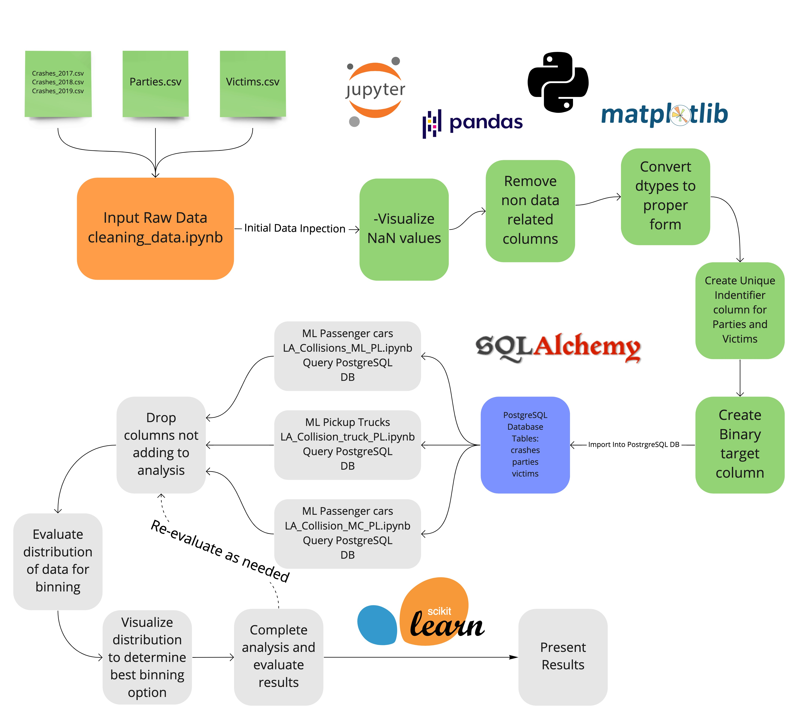

## Cleaning the dataset
To complete the machine learning analysis using the dataset downloaded from the TIMS, the data needed to be cleaned to ensure that it could be integrated into the analysis script.  The data was divided into 3 datasets containing the crash data (crashes_df), party data (parties_df) and the victims (victims_df). To clean the data the following steps were complete.

### Parties Dataset

1. Empty entries containing "-" were converted to NaN values as the data contained in these did not add to the analysis
2. Columns were evaluated to determine the number of null values and columns containing number of greater than 90% were removed.
3. Entries with blank values were dropped using dropna() to finalize the data set.
4. Float values were converted to integers where not required
5. Each column was evaluated to see the distribution for each observation definition within each object-based column in the dataset.
6. Two safety equipment columns were concatenated to create one column containing all relevant safety equipment values for each accident.

### Victims Dataset

1. Empty entries containing "-" were converted to NaN values as the data contained in these did not add to the analysis
3. Entries with blank values were dropped using dropna() to finalize the data set.
4. Float values were converted to integers where not required
5. Each column was evaluated to see the distribution for each observation definition within each object-based column in the dataset.
6. Two safety equipment columns were concatenated to create one column containing all relevant safety equipment values for each accident.
7. VICTIM_DEGREE_OF_INJURY used to create binary column 'SEVERE_INJURY' which grouped severe and fatal injuries and minor and no injury events

### Crashes Dataset

1. Data from the three year was concatenated to create a dataset containing all the crash data
2. Empty entries containing "-" were converted to NaN values as the data contained in these did not add to the analysis
3. Columns were evaluated to determine if the data contained within the table was related to the analysis and none essential data was removed.
4. Columns were evaluated to determine the number of null values and columns containing number of greater than 90% were removed.
5. Columns containing binary data with blanks in place of "0' values were filled and "Y" cells were filled with "1"
5. Entries with blank values were dropped using dropna() to finalize the data set.
6. Float values were converted to integers where not required
7. Duplicate values were removed
7. Each column was evaluated to see the distribution for each observation definition within each object-based column in the dataset.

---

## Database Development

 The datasets were connected by a CASE_ID number that connected the accident event with the parties and victim data. The parties and victim dataframes were evaluated to ensure that they contained the CASE_ID that remained in the cleaned crashes dataframe, any nonmatching rows were dropped to ensure that they could be loaded into the database. To ensure that the party and victim data could be used effectively with postgreSQL, a PARTY_ID column was added to the parties_df to link the victim data by matching the CASE_ID and PARTY_NUMBER columns.  The PARTY_ID column was added to the victims_df to allow for queries to be completed which linked the victim data to the party data.  This was essential to ensure queries joining data from all three tables through primary and foreign keys.  The parties data related to the vehicles involved in the incident and the victims data contains the data related to each victim of the accident.  The crash data contains the conditions during the time the accident occurred.  The there dataframes could be used to create a complete dataframe that could be used in the machine learning model by completing a query on the dataframe loaded into the data set.  A schema containing the structure of the dataframe and the relationship between each table was saved.

---

## Machine Learning Model

In the development of the machine learning model two major factors were considered for the development strategy.  First is the prediction should hold some accessible link to the original data, so key predictive factors could be identified and presented at the end of the analysis.  The second is the dataset is unbalances in regard to the severity of the injuries to the victims with fewer fatalities and severe injuries observed over minor to no injury.  For this we looked at multiple resampling and ensemble models to evaluate for the greatest accuracy for predicting the outcome based on the training and testing data.

### Preprocessing

The data going into the models had minor preprocessing to remove missing data and formatting to standardize the columns going in.  The data for the analysis was collected through a postgreSQL query to collect the initial data from the raw dataset with a filter for the type of vehicle.  For this study we separated the incidents involving cars, trucks and motorcycles to be analyzed separately as we felt there was a large enough difference between each to require separate analysis.  The dataset were imported into JupyterLab for additional processing.  The data was processed through the following steps

1. Dropped columns containing data which did not add relevant data to the analysis of the accident severity
2. Evaluated the distribution of each object datatype column to determine if binning data was required
3. Visualize distribution to create determine how best to bin categories with low number of observations
4. Re-evaluate after analysis

### Analysis

With the data processed the dataset was split into the training and testing set using the "SEVERE_INJURY" column as the target using the train_test_split method from SKlearn. The training set consisted of 75% of the data and the testing set was 25% of the total dataset with it the date stratified to balance the number of severe injury between the testing and training sets. To determine the best methodology to create a machine learning model to give insight into the severity of injuries as a result of collisions.  As the number of severe and fatal injuries were much lower than the minor injuries the dataset was treated as an unbalanced model requiring resampling or ensemble methods to improve the predictability of the model.  

The initial analysis was focused on the vehicle and the factors contributing to the collision.  This was targeted to determine factors linked to the vehicle that could be linked to the severity of the injuries incurred during the accident.

#### Test Results Autos

<table>
    <tr>
        <td>RandomSampler</td>
        <td>SMOTE</td>
        <td>SMOTEENN</td>
    </tr>
    <tr>
        <td>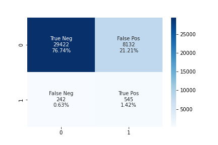</td>
        <td></td>
        <td></td>
    </tr>
    <tr>
        <td>Balanced Random Forest Classifier</td>
        <td>Easy Ensemble Classifier</td>
    </tr>
    <tr>
        <td></td>
        <td>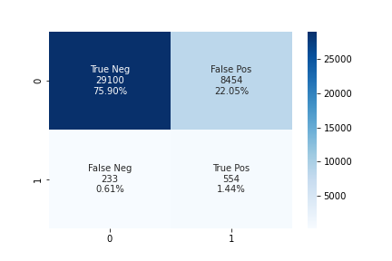</td>
    </tr>
</table>

#### Test Results Trucks

<table>
    <tr>
        <td>RandomSampler</td>
        <td>SMOTE</td>
        <td>SMOTEENN</td>
    </tr>
    <tr>
        <td>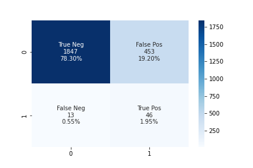</td>
        <td>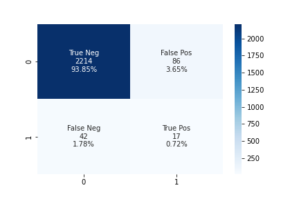</td>
        <td>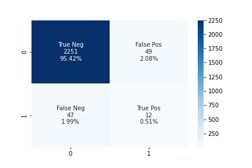</td>
    </tr>
    <tr>
        <td>Balanced Random Forest Classifier</td>
        <td>Easy Ensemble Classifier</td>
    </tr>
    <tr>
        <td></td>
        <td>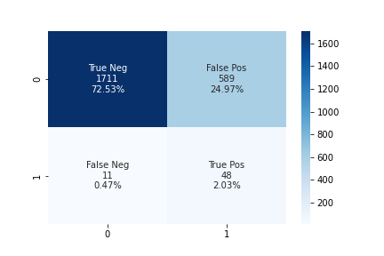</td>
    </tr>
</table>

#### Test Results MC

<table>
    <tr>
        <td>RandomSampler</td>
        <td>SMOTE</td>
        <td>SMOTEENN</td>
    </tr>
    <tr>
        <td>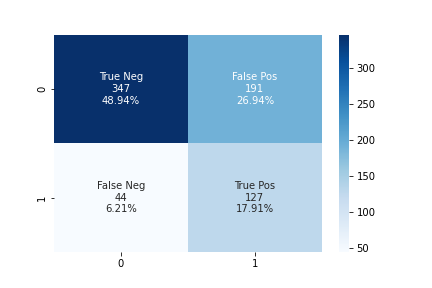</td>
        <td>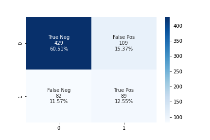</td>
        <td></td>
    </tr>
    <tr>
        <td>Balanced Random Forest Classifier</td>
        <td>Easy Ensemble Classifier</td>
    </tr>
    <tr>
        <td></td>
        <td>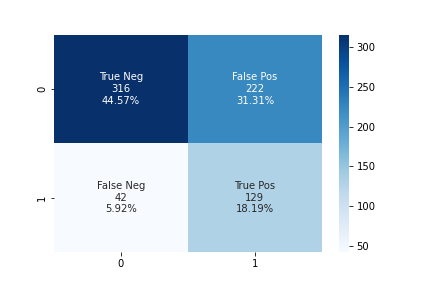</td>
    </tr>
</table>

### Model Selection

From the analysis of each method the EES models have the greatest predictive accuracy however the Balanced Random Forest Classifier (BRFC) model, similar predictive strength coupled with the ability to share key importances related to the features used in the model gives greater insights for the analysis.  The BRFC model provided good accuracy and improved precision for both the severe and non-injury predictions which made it the best choice overall.  The BRFC however is limited as there were cases of overtraining evident in the motorcycle data due to the smaller dataset and limited severe injury cases and minor anomalies in the data were amplified due to the imbalanced dataset.  Additionally, the analysis was difficult to explain due to the randomness of the algorithm.

### Balanced Random Forest Classifier

Analysis of the crash data using random forest classifier provides key predictive indicators related to the factors determining the severity of the injuries incurred in the accidents.  From the analysis for each vehicle type the top 15 importances to highlight the factors that help predict the outcome of the accidents.  Grouping the data by victim vehicle type the model was trained to determine the accuracy and precision of the model and give insight into the key features used to predict the outcome.  

#### Passenger Car Analysis

The machine learning model of passenger car collisions using the BRFC model created the following information.

<table class="table table-lg"
    <tr>
        <td> Confusion Matrix </td>
        <td> Top Importance features </td>
    </tr>
    <tr>
        <td>  </td>
        <td>  </td>
    </tr>
    <tr>
        <td colspan="2"> Classification report ML Passenger Cars </td>
    </tr>
    <tr>
        <td colspan="2">  </td>
    </tr>
</table>

The model created using the passenger car data had and accuracy of 72.83% which is a moderate indicator of predictability using this data.  The model was better at predicting the non-severe injuries with 27% false positives versus 25% false negatives for severe injures.  This is reflected in the F1 score that has an 84% for non-severe and 10% for severe injuries.  As this is an unbalanced model with severe injuries being represented less in the data it shows the challenges of creating an accurate model.  Based on the analysis the top importances identified using this model the factors that contributed to the predictions were identified. These can be investigated further to evaluate the key factor and how they correspond to severe injuries as observed in the data.  

#### Pickup Truck Analysis

Using the same machine learning BRFC model on collisions involving pickup trucks created the following information.

<table class="table table-sm"
    <tr>
        <td>Confusion Matrix</th>
        <td>Top Importance features</th>
    </tr>
    <tr>
        <td>  </td>
        <td>  </td>
    </tr>
    <tr>
        <td colspan="2"> Classification report ML Trucks</td>
    </tr>
    <tr>
        <td colspan="2">  </td>
    </tr>
</table>

The analysis of the collisions involving pickup trucks involved a much smaller sample size of only 9435 collisions.  This model had a higher accuracy than observed in the passenger car model with a calculated value of 77.64% which also makes it a moderately accurate model.  An analysis of the model show that it has an 23% false positive prediction and a 19% false negative indicating that this model was stronger at predicting severe injuries than observed in the model create using the passenger car data.  The top importances highlighted some key indicators for injury severity and using this information further analysis of these key factors in relation to the severity of the injuries can be conducted.  Again this model involved unbalanced data which adds to the challenge of the creation of an accurate predictive model.

#### Motorcycle/Scooter Analysis

The final machine learning using the BRFC model on collisions involving motorcycles and scooters provided the following information.

<table class="table table-lg"
    <tr>
        <td>Confusion Matrix</th>
        <td>Top Importance features</th>
    </tr>
    <tr>
        <td>  </td>
        <td>  </td>
    </tr>
    <tr>
        <td colspan="2"> Classification report ML Motorcycle/Scooters </td>
    </tr>
    <tr>
        <td colspan="2">  </td>
    </tr>
</table>

The analysis of the motorcycle data contained a much smaller dataset containing only 2835 incidents.  The accuracy of the model was much lower at 63.18% making it a much less dependable model for predicting the severity of the injuries in the collision. This was evident in the 40% false positives observed from the testing set. There were 27% false negatives identified indicating that the model was better at predicting severe injuries however the model is limited in its predictive strength.  The top importances identified showed two categories contributed the most to the model which involved victim sobriety and if the victim was ejected from the vehicle.  These factors can be used for further analysis on the dataset to see how they contributed to the severity of the accidents.

### Driver Factor Analysis

Upon looking at the results of the conditions related to the vehicle with relation to the accidents, a focus on the driver controlled factors was evaluated to determine which factors would predict accident severity based on features surrounding the driver and passenger conditions.  Using the same methodology described above a model for each type of vehicle category was conducted determine the factors key to predicting the collision injury severity.

#### Driver Analysis

The machine learning model of passenger car collisions using the BRFC model created the following information.

<table class="table table-lg"
    <tr>
        <td> Confusion Matrix </td>
        <td> Top Importance features </td>
    </tr>
    <tr>
        <td> 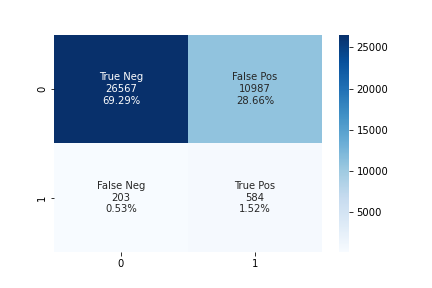 </td>
        <td> 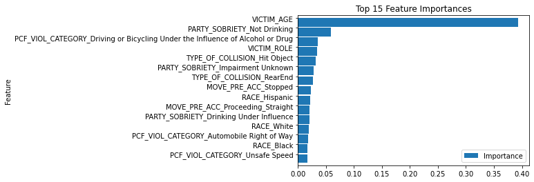 </td>
    </tr>
    <tr>
        <td colspan="2"> Classification report ML Passenger Cars </td>
    </tr>
    <tr>
        <td colspan="2">  </td>
    </tr>
</table>

Using the same machine learning BRFC model on collisions involving pickup trucks created the following information.

<table class="table table-sm"
    <tr>
        <td>Confusion Matrix</th>
        <td>Top Importance features</th>
    </tr>
    <tr>
        <td>  </td>
        <td> 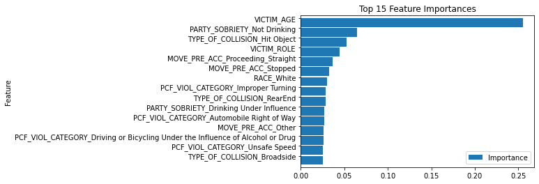 </td>
    </tr>
    <tr>
        <td colspan="2"> Classification report ML Trucks</td>
    </tr>
    <tr>
        <td colspan="2"> 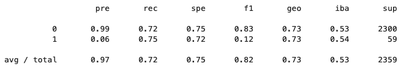 </td>
    </tr>
</table>

The final machine learning using the BRFC model on collisions involving motorcycles and scooters provided the following information.

<table class="table table-lg"
    <tr>
        <td>Confusion Matrix</th>
        <td>Top Importance features</th>
    </tr>
    <tr>
        <td> 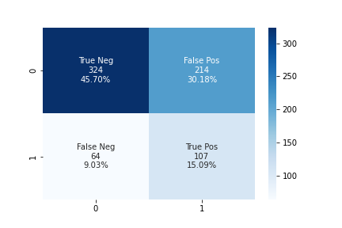 </td>
        <td> 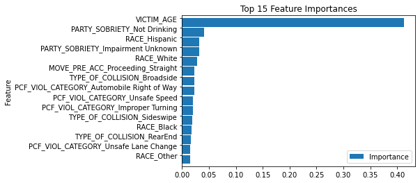 </td>
    </tr>
    <tr>
        <td colspan="2"> Classification report ML Motorcycle/Scooters </td>
    </tr>
    <tr>
        <td colspan="2"> 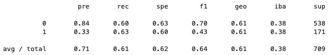 </td>
    </tr>
</table>

The models created for the driver related features resulted in less accurate models that the vehicle factor models initially created.  The passenger car model produced an accuracy of 70.81% using the test dataset with 29% false positives and 26% false negatives.  The pickup truck data analysis produced a model with 71.97% accuracy with 28% false positives and 75% false negatives.  Finally, the motorcycle dataset produced a model with a 60.78% accuracy with 40% false positives and 37% false negatives.  All models showed some evidence of overtraining as the predicted accuracy was greater than the test accuracy.  Thought the models create all showed a reduced predictive accuracy they were all consistent in the identification of age as a major predictor of collision severity with it contributing as much as 40% to the predictive model.  The other factors however dropped significantly in comparison to age with low contributions to the prediction of the model.

## Dashboard development

To visualize the data, a combination of Tableau and HTML was used to create a dashboard that summarizes the finding from this analysis.  Using Tableau, interactive dashboards were created to display the data and allow users to filter on categories to customize the view.  The Tableau dashboards were integrated into a webpage which also includes details on the machine learning models and the analysis resulting from the models.  The [final website](https://wattsr1.github.io/LA-Collision-Analysis/) was deployed on Github for the public to access.  

## Presentation Draft

A brief presentation of the project has been drafted on Google Slides.  [The draft can be viewed online](https://docs.google.com/presentation/d/1KghLo6V3xyFp05sskCO4CUClffk0LA8iuVf46Gt23bM/edit?usp=sharing)

